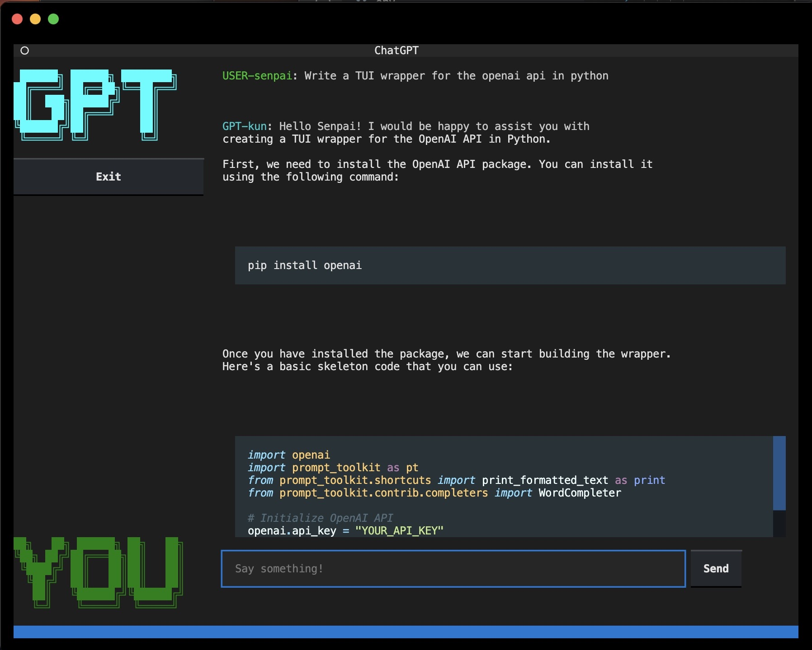

# Terminal Based Chat-GPT



## Install

```
pip install openai python-dotenv textual
```

Edit `.env` to use your api key and organization id (found [here](https://platform.openai.com/account/org-settings))

```
OPENAI_API_KEY=
OPENAI_ORGANIZATION_ID=
```

```
python ./chat.py
```

## Use

Just type in your prompt. The request is sent to the `text-davinci-003` model for text completion.

To quit, type `exit` or `quit`.

Reset the conversation with `reset`, `clear` or `start over`

All other text is considered a prompt and sent to GPT.